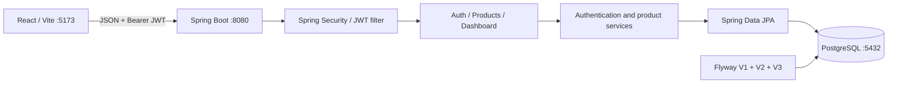

# ISMES project index and local startup fixes

Updated on 20 September 2026. The application root is `ismes/`, one level below the opened `inventory-system/` workspace. All paths below are relative to `ismes/` unless stated otherwise.

The reported restart loop came from a database/entity type mismatch: V1 created INTEGER identifiers while the existing Java entities use Long and expect BIGINT. New migration V3 widens the affected identifiers, foreign keys and sequences while preserving existing records. V1 and V2 remain unchanged, and Hibernate schema validation remains enabled.

The source now also includes admin initialization, consistent authentication/API errors, product request fixes, frontend session recovery and unavailable states, disabled unfinished navigation, automated tests, and build/lint tooling. This index describes the implemented source; the verification table separates completed checks from work still being verified. See `README.md` for the main setup guide.

## Coverage and runtime evidence

The initial review covered all 58 existing project files outside dependencies/build output. The file index below now includes the added application, test, migration and tooling files. Installed third-party source in `node_modules`, Maven caches, generated output, and duplicate archive contents are excluded.

| Check | Status | Coverage / limit |
|---|---|---|
| Original logs and read-only schema inspection | Root cause confirmed before changes | PostgreSQL was reachable; V1/V2 succeeded; mapped IDs were INTEGER |
| `scripts/check-migrations.sh` | Passed against disposable PostgreSQL 16 | Existing data/relationships, sequence positions, both views, IDs above the INTEGER limit, FK enforcement and item delete cascades |
| Packaged Flyway upgrade and Hibernate startup | Pending final verification | Migration script tests SQL directly; application startup also verifies packaging and JPA mappings |
| Backend controller/auth/admin tests | Added; execution pending final verification | Product stock/input/error behavior, authentication and bootstrap regressions |
| Frontend tests/lint/build | Updated; execution pending final verification | Session/API behavior, JSX lint and production compilation |
| Live API health and login | Pending final verification | Confirm the rebuilt backend reaches health UP and authentication succeeds |

Host tools observed: Node 20.20.2, npm 10.8.2, Maven 3.6.3, active Java 17, Docker 29.8.1, Compose 5.5.1. Container logs show Java 21.0.12 and PostgreSQL 16.14. The host Java mismatch is separate from the Docker crash: Docker already uses Java 21.

## Architecture and implemented behavior



Docker Compose starts the database and API. The React frontend runs separately through npm. Inside the Compose network the database hostname is `db`; a backend launched directly on the host uses `localhost`. The browser calls `http://localhost:8080/api` directly; there is no Vite proxy. The backend Docker image uses Java 21, runs Maven verification during its build, and checks `/actuator/health` for container health.

Login flows through `Login → AuthContext → Axios → AuthController → AuthenticationManager → UserDetailsServiceImpl → UserRepository`. BCrypt verifies the password, `JwtUtil` signs the JWT, and the frontend stores the token and user summary in localStorage. Login requests omit stored bearer tokens. Later requests pass through `JwtAuthFilter`, which verifies the token, reloads the user, checks account state and populates Spring's security context. Invalid/expired tokens receive JSON 401; authenticated users without permission receive JSON 403. A frontend 401 clears saved and in-memory authentication state, and malformed saved sessions recover to login.

Product operations flow through controller → transactional service → repositories → DTO mapping. Creation requires opening stock and initializes current stock from it. Updates accept product details without opening stock and preserve both existing opening and current stock. Deleting a product marks it inactive; list and search exclude inactive products. Low stock means active products with current stock at or below the minimum. Inputs enforce database length/null/price-precision limits; missing products/categories receive 404 and duplicate/conflicting writes receive 409.

The implemented UI has `/login`, `/` (dashboard), and an unknown-route fallback. Product APIs exist, but there is no inventory management screen. Unfinished sidebar modules are disabled and marked “Soon.” Dashboard low-stock data comes from products; financial totals and recent transactions remain backend placeholders. Failed dashboard requests display unavailable states. Database tables for future modules do not mean those modules have been implemented.

## Complete file index

| Root/configuration file | Purpose |
|---|---|
| `README.md` | Setup instructions, architecture decisions, frontend instructions and feature roadmap |
| `docker-compose.yml` | PostgreSQL and backend services, ports, persistent database volume, restart policy, DB health check |
| `.env.example` | Compose database/JWT/admin configuration template |
| `.gitignore` | Environment, build output, IDE and dependency exclusions |
| `backend/pom.xml` | Spring Boot 3.3.4, Java 21, JPA, Security, Flyway, PostgreSQL, JWT, Swagger, unused iText dependency and test dependencies |
| `backend/Dockerfile` | Maven/Java 21 build stage and Java 21 JRE runtime |
| `backend/src/main/resources/application.yml` | Datasource, Hibernate validation, Flyway, JWT/admin properties, Swagger and logging |
| `backend/src/main/resources/db/migration/V1__init_schema.sql` | All 12 tables, indexes, constraints and two views |
| `backend/src/main/resources/db/migration/V2__seed_data.sql` | Fixed admin account, four product categories and five expense categories |

The following Java paths are under `backend/src/main/java/com/joseph/ismes/`.

| Java file | Purpose |
|---|---|
| `IsmesApplication.java` | Spring Boot entrypoint |
| `config/SecurityConfig.java` | Password encoder, authentication provider/manager, stateless security chain, public paths and CORS |
| `security/JwtUtil.java` | JWT signing, claims, signature and expiry verification |
| `security/JwtAuthFilter.java` | Bearer-token extraction and security-context authentication |
| `entity/User.java` | User persistence and Spring Security UserDetails contract |
| `entity/Role.java` | ADMIN and SALES roles |
| `entity/Category.java` | Product category persistence |
| `entity/Product.java` | Product, pricing, stock, active state and lifecycle timestamps |
| `repository/UserRepository.java` | User lookup by username and existence check |
| `repository/CategoryRepository.java` | Category persistence |
| `repository/ProductRepository.java` | Product persistence, code/name search, duplicate check and low-stock query |
| `service/UserDetailsServiceImpl.java` | Loads users for authentication |
| `service/ProductService.java` | Transactional product listing/search/create/update/deactivation |
| `service/DashboardService.java` | Real low stock plus placeholder financial/transaction summary |
| `controller/AuthController.java` | Login endpoint |
| `controller/ProductController.java` | Product endpoints and ADMIN write restrictions |
| `controller/DashboardController.java` | Dashboard summary endpoint |
| `dto/LoginRequest.java` | Username/password validation |
| `dto/LoginResponse.java` | JWT and user identity returned after login |
| `dto/ProductRequest.java` | Product input and partial validation |
| `dto/ProductResponse.java` | Product/category response fields and entity mapping |
| `dto/DashboardSummaryResponse.java` | Dashboard metrics/lists and nested transaction DTO |
| `dto/ApiError.java` | Timestamp, status and error message response |
| `exception/GlobalExceptionHandler.java` | Controller exception-to-HTTP translation |

The following frontend paths are under `frontend/`.

| Frontend file | Purpose |
|---|---|
| `package.json` | Dependencies and dev/build/preview/lint scripts |
| `package-lock.json` | Resolved npm dependency tree |
| `.env.example` | Optional `VITE_API_BASE_URL` configuration |
| `vite.config.js` | React plugin and preferred dev port 5173 |
| `postcss.config.js` | Tailwind and Autoprefixer integration |
| `tailwind.config.js` | Design colors, fonts and source scanning |
| `index.html` | HTML entrypoint, root element and Google Fonts stylesheets |
| `src/main.jsx` | React mount and StrictMode |
| `src/App.jsx` | Auth provider, browser router, login and dashboard routes |
| `src/index.css` | Base styling, ledger components and reduced-motion rules |
| `src/api/client.js` | API base URL, JWT header and HTTP 401 session cleanup |
| `src/context/AuthContext.jsx` | Login/logout, localStorage user state and login errors |
| `src/routes/ProtectedRoute.jsx` | Frontend user-presence route guard |
| `src/pages/Login.jsx` | Login form and dashboard redirect |
| `src/pages/Dashboard.jsx` | Summary API request and dashboard layout |
| `src/layout/AppShell.jsx` | Sidebar, topbar and page frame |
| `src/layout/Sidebar.jsx` | Dashboard and five links to unimplemented routes; inline SVG icons |
| `src/layout/Topbar.jsx` | Local date, current user and logout |
| `src/components/StatCard.jsx` | Dashboard metric display |
| `src/components/LowStockPanel.jsx` | Low-stock listing/loading/empty state |
| `src/components/RecentTransactionsTable.jsx` | Transaction table/loading/empty state |
| `src/lib/format.js` | UGX currency, quantity and date formatting |

| Other file | Purpose |
|---|---|
| `.github/modernize/java-upgrade/.gitignore` | Ignores modernization tool artifacts |
| `.github/modernize/java-upgrade/hooks/scripts/recordToolUse.sh` | Editor-extension tool-use recording hook for Bash; not part of application startup |
| `.github/modernize/java-upgrade/hooks/scripts/recordToolUse.ps1` | Equivalent PowerShell recording hook |

`../ismes-fullstack.zip` is the supplied archive. `backend/target`, `frontend/node_modules` and `frontend/dist` are generated/dependency directories. `frontend/public` and the backend test source tree contain no application files at review time. No Maven wrapper, frontend Dockerfile, or CI workflow was found.

## API and database index

| Method and path | Access | Behavior |
|---|---|---|
| `POST /api/auth/login` | Public | Takes username/password; returns token, username, fullName, role |
| `GET /api/products` | Authenticated | Lists products; optional `?search=` filters name/code |
| `GET /api/products/low-stock` | Authenticated | Lists active products at/below minimum stock |
| `GET /api/products/{id}` | Authenticated | Product details |
| `POST /api/products` | ADMIN | Creates product; 201 |
| `PUT /api/products/{id}` | ADMIN | Updates product metadata/prices/minimum stock |
| `DELETE /api/products/{id}` | ADMIN | Deactivates product; 204 |
| `GET /api/dashboard/summary` | Authenticated | Returns real low stock and placeholder financial/transaction fields |
| `GET /actuator/health` | Public | API/database health |
| `/swagger-ui/index.html`, `/v3/api-docs` | Public | Swagger UI/OpenAPI; advertised `/swagger-ui.html` is missing from public matchers |

| Database object | Current application use |
|---|---|
| `users` | Login, roles and JWT user lookup |
| `categories` | Product category relationship; no category API |
| `products` | Product API and low-stock dashboard |
| `expense_categories` | Seeded; no expense module |
| `suppliers`, `purchases`, `purchase_items` | Schema only; supplier and stock-in modules pending |
| `sales`, `sale_items` | Schema only; sales, stock-out and receipt modules pending |
| `expenses` | Schema only; expense module pending |
| `notifications` | Schema only |
| `activity_logs` | Schema only |
| `v_daily_profit` | SQL aggregation exists but is not queried by DashboardService |
| `v_low_stock` | SQL view exists; Java currently uses an equivalent JPQL query |
| `flyway_schema_history` | Flyway-created migration bookkeeping |

There are no user-management, password-change, category-listing, supplier, purchase, sale, expense, reporting, notification, audit-log or stock-adjustment endpoints. iText is declared but has no receipt/report implementation.

## Fix the restart loop first

The decisive log message is:

```text
Schema-validation: wrong column type encountered in column [id] in table [categories];
found [serial (Types#INTEGER)], but expecting [bigint (Types#BIGINT)]
```

The relevant code is `entity/Category.java:21`, `entity/User.java:28`, `entity/Product.java:24`, `V1__init_schema.sql:13,29,45,48`, and `application.yml:13`. The later `entityManagerFactory`, `userRepository`, `jwtAuthFilter`, and Tomcat errors follow from that failed validation.

PostgreSQL SERIAL creates an INTEGER column; Hibernate maps Java Long to BIGINT. The distinction is documented in the [PostgreSQL 16 numeric type reference](https://www.postgresql.org/docs/16/datatype-numeric.html#DATATYPE-SERIAL) and [Hibernate 6.5 type mappings](https://docs.jboss.org/hibernate/orm/6.5/javadocs/org/hibernate/type/StandardBasicTypes.html).

Recommended correction: retain Java Long identifiers and add `backend/src/main/resources/db/migration/V3__align_identifier_types.sql`. The complete scope for the currently mapped entities is:

| Object | Required change |
|---|---|
| `users.id`, `categories.id`, `products.id` | Widen to BIGINT |
| `products.category_id` | Widen to BIGINT to match categories |
| `purchases.created_by`, `sales.created_by`, `sale_items.authorized_by`, `expenses.created_by`, `activity_logs.user_id` | Widen to BIGINT to match users |
| `purchase_items.product_id`, `sale_items.product_id`, `notifications.related_product_id` | Widen to BIGINT to match products |
| `users_id_seq`, `categories_id_seq`, `products_id_seq` | Change sequence type to BIGINT, preserving current values and defaults |
| `v_low_stock` | Drop and recreate within the migration because it depends on the type of `products.id` |
| `activity_logs.entity_id` | Also consider BIGINT: this non-FK field is intended to hold identifiers from multiple entity types |

Preserve existing foreign-key relationships, including any delete actions. Drop `v_low_stock` before altering any columns, then drop affected foreign keys, widen the identifiers/referencing columns and sequences, and recreate the constraints and low-stock view within the migration transaction. `v_daily_profit` does not reference these particular widened columns and need not change for this scope. Quantity fields such as opening/current stock should remain INTEGER.

V1 and V2 are already applied in this database. Leave their contents intact and let Flyway apply a new migration; changing V1 creates a checksum mismatch and does not upgrade an existing schema correctly. This follows [Flyway's migration workflow](https://www.red-gate.com/hub/product-learning/flyway/supporting-monolithic-database-deployment-with-flyway/). Keep `ddl-auto: validate` so the mapping remains checked. Recreating the same schema or disabling validation does not correct the underlying mismatch.

An alternative is to retain the INTEGER schema and consistently change identifier types to Integer across entities, repository generics, services, controller parameters and DTOs. Changing only `Category.id` would leave the remaining mismatches. Prefer one identifier convention throughout the implemented modules.

The widening migration should be verified against a separate database initialized with V1/V2 before applying it to an existing database. This review inspected the existing database read-only and did not apply a candidate migration.

## Other issues and specific remedies

| Priority / symptom | Evidence | Remedy |
|---|---|---|
| Host Maven fails with Java release error | `backend/pom.xml` targets 21; `mvn -version` reports 17 | Use the existing Docker build or install/select JDK 21 for both Maven and the IDE. Confirm `mvn -version` shows 21 |
| Login reports bad credentials while API is unavailable | `frontend/src/context/AuthContext.jsx:28` uses the credential message for transport errors | Show a distinct API-unreachable error when no HTTP response exists; fix backend startup before retrying passwords |
| Admin environment variables appear ineffective | `application.yml:27` defines values but no Java class consumes them; V2 inserts a fixed account | Add idempotent admin bootstrap logic and a real password-update path, or remove misleading settings/docs. The supplied seed hash was verified to match `admin123` |
| Login/API can fail after a token expires | `JwtAuthFilter.java:40` parses without handling JWT exceptions; Axios attaches stored tokens even to login | Skip token processing for login; catch token failures in the filter and return consistent 401 responses. Do not send an old bearer token with a new login request |
| Session reset is unreliable for authorization failures | Axios clears storage only for 401; security config does not explicitly configure a JSON authentication entrypoint | Configure unauthenticated responses as 401 and forbidden responses as 403. Runtime status behavior remains unverified while startup fails |
| Documented Swagger entry URL is protected | `SecurityConfig.java:59` allows `/swagger-ui/**` but not `/swagger-ui.html` | Permit `/swagger-ui.html`; meanwhile use `/swagger-ui/index.html` after API startup |
| Clicking Inventory/Suppliers/Sales/Expenses/Reports leaves no matching screen | `Sidebar.jsx:5` links these paths; `App.jsx:13` defines only two routes | Implement those routes/pages or disable unfinished links and provide a fallback route |
| Dashboard shows zero totals/no transactions | `DashboardService.java:31` deliberately returns zeros/empty list | Implement sales/expenses and aggregation. Configuration changes will not populate these placeholders |
| Initial low-stock list is empty | V2 seeds no products; current DB has zero products | Add products through the existing API after startup; inventory UI is pending |
| Blank page with malformed saved user state | `AuthContext.jsx:7` performs unguarded JSON parsing | Safely parse/validate stored state and clear inconsistent sessions |
| Dashboard shows zero/all-stock-healthy alongside an API error | `Dashboard.jsx:60`, `format.js`, `LowStockPanel.jsx:15` treat absent data like empty data | Render unavailable state on failed requests; show zero/empty results only after successful responses |
| Lint fails | `frontend/package.json:10` runs ESLint without declaring/installing/configuring it | Add ESLint with React/JSX configuration, or remove unsupported script |
| Docker warns that `version` is obsolete | `docker-compose.yml:1` | Remove the top-level version field as cleanup; it is not the startup blocker |

For a browser session specifically affected by stale/malformed auth storage, run this in the frontend page's browser console and sign in again after the API is healthy:

```js
localStorage.removeItem("ismes_token");
localStorage.removeItem("ismes_user");
location.assign("/login");
```

Additional API behavior to address during implementation: list/search includes deactivated products; PUT requires `openingStock` but ignores it; validation omits some SQL length/null/precision constraints; missing products return 400 instead of 404; generic exception handling hides server failures and may turn access-denied exceptions into 500 responses. JWT authentication also does not check a loaded user's enabled state. These are source-level findings, not reproduced endpoint failures, because the API cannot currently start.

CORS already permits all origin patterns for local development. No evidence points to CORS as the present failure. Root and frontend `.env` files were absent, but defaults match this local setup, so their absence alone does not explain the crash. The backend's Compose service lacks a health check, which helps explain why container status can look reassuring while it restarts.

## Local startup and verification after the schema correction

From the actual project directory, rebuild the API with the new migration and keep the existing database volume:

```bash
cd /home/jojo/Desktop/Code/inventory-system/ismes
docker compose up -d --build
docker compose logs --tail 100 backend
curl --fail http://localhost:8080/actuator/health
```

Wait for `Started IsmesApplication` and an HTTP 200 health response containing `"status":"UP"`. If the API is still restarting, inspect the first schema-validation error in the latest startup attempt. Do not use `docker compose down -v` as a troubleshooting step: it deletes the database volume and the unchanged V1 schema would reproduce the same mismatch.

The frontend is already serving on port 5173 on this machine. For a fresh frontend terminal when it is not running:

```bash
cd /home/jojo/Desktop/Code/inventory-system/ismes/frontend
npm ci
npm run dev
```

Open `http://localhost:5173`. `frontend/.env.example` is optional with the default API address; if changing it, set `VITE_API_BASE_URL` to an address reachable by the browser and restart Vite. The API base URL includes `/api`. Keep the two environment contexts distinct: Compose's project `.env` is not automatically a host Maven environment or the frontend's `.env`.

Verify the seeded account after API startup:

```bash
curl --fail-with-body http://localhost:8080/api/auth/login \
  -H 'Content-Type: application/json' \
  -d '{"username":"admin","password":"admin123"}'
```

These are the source migration's credentials, assuming the account has not been changed in the database. The runtime review checked user count and schema only; it did not read or verify the live account's stored password. Then use the returned token for `/api/products` and `/api/dashboard/summary`, or sign in through the frontend. The Swagger URL compatible with the current security matcher is `http://localhost:8080/swagger-ui/index.html`.

If choosing native backend development, select JDK 21 first and verify Maven uses it; start only the Compose database, configure `SPRING_DATASOURCE_URL/USERNAME/PASSWORD` as needed, and run `mvn spring-boot:run` in `backend/`. Stop the existing Compose backend before using the same host port 8080. The Docker-based path already provides the required Java runtime and avoids this extra host setup.
